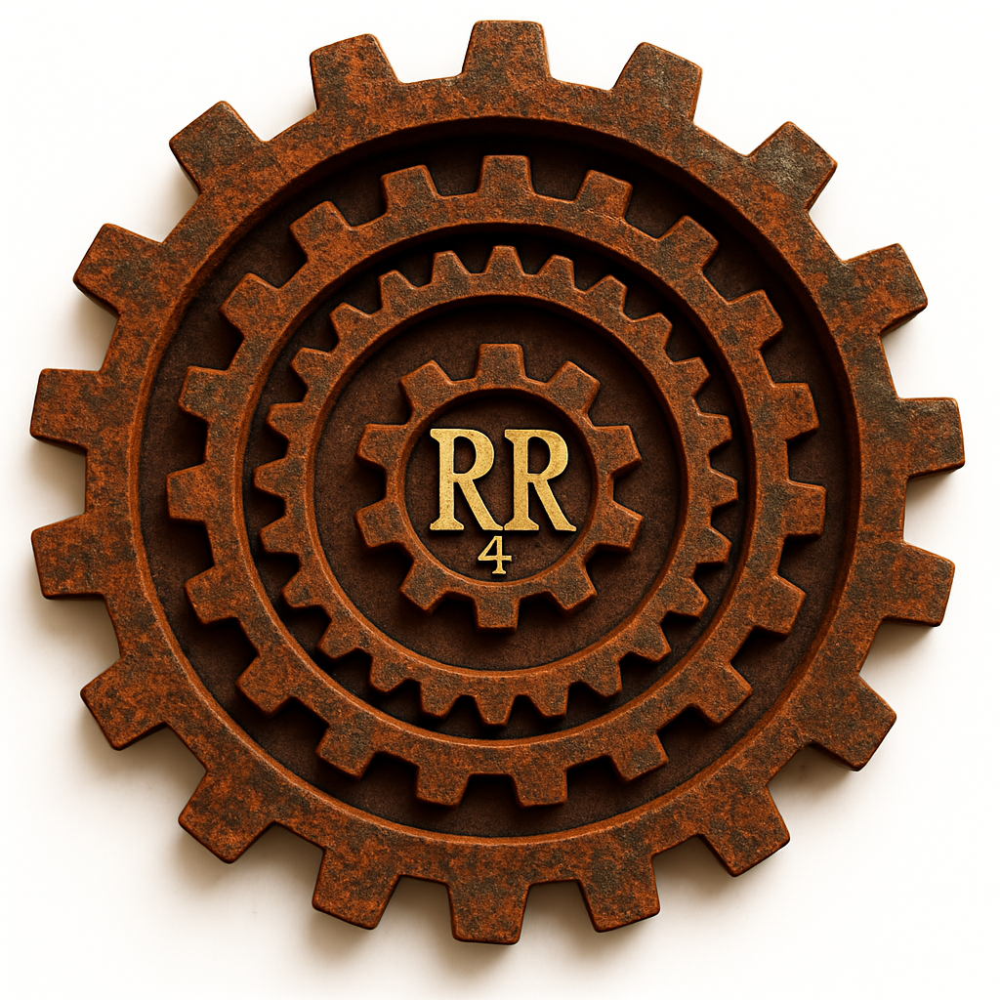
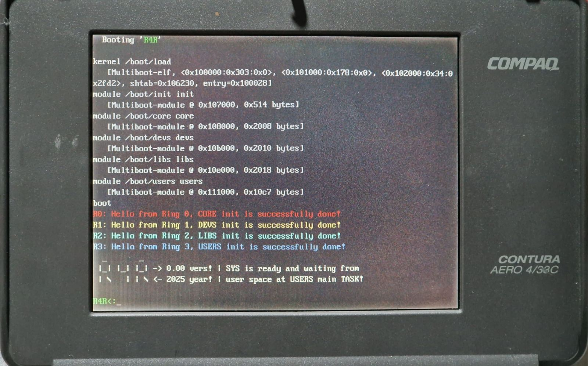
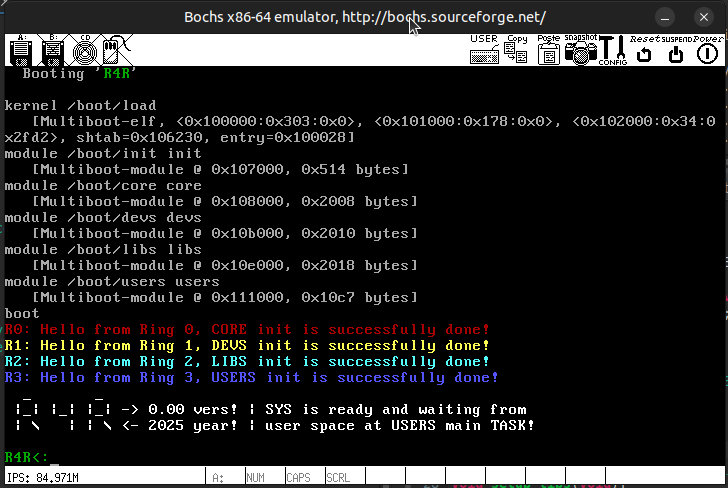

# 🛡️ R4R — Rusted 4 Rings

> A hobby operating system experiment for educational and artistic purposes.

**R4R** is a hobby operating system project built from scratch with the goal of fully demonstrating the functionality and interplay of all four Intel x86 privilege levels — Ring 0 to Ring 3 — starting from the i386 architecture.

This is a personal and educational endeavor to explore legacy hardware features that are often overlooked or abstracted away in modern operating systems.

> ⚠️ **Note:** This is a hobbyist and educational project. It is not intended for production use. Expectations should be modest as development is done slowly, with care and curiosity.

---

## ✨ About This Project

> *"For a self-taught person like me, who is still learning to code, realizing an idea by writing from scratch is not an easy process at all. There is also a fear of failure and ridicule from genius people and professionals. But sincere desire and joy when you master the basic functionality of hardware — even just a little — overcomes all obstacles. It is an even greater inspiration that this little work will mean at least something to someone."*

This project was born from the curiosity and joy of exploring the **Intel x86 privilege ring model**, and particularly the lack of accessible examples demonstrating how all **four protection rings** interact in a real operating system environment.

Surprisingly, no public code example or documentation clearly showcases how **Ring 0 to Ring 3** can cooperate within a functioning kernel — especially in the context of a minimalist, bare-metal OS.

> *“Would it be possible to create a working OS kernel that utilizes **all four rings**, not for fun only, but to explore what functionality, structure, and security features Intel had envisioned?”*

This project aims to answer that question — even if only partially — and in doing so, encourages others to look back at the hardware roots of operating system design.

## Project Description

**R4R** is an *experimental hobbyist operating system* designed to showcase and demystify the functionality and interaction of all four Intel x86 protection rings (Ring 0–3), starting with the i386 architecture. It is not intended as a full-fledged operating system, but rather a platform for learning, demonstration, and artistic expression.

It stems from a curiosity to explore underutilized or forgotten hardware features. While most modern systems operate using only Ring 0 (kernel) and Ring 3 (user), **R4R** attempts to bring all four rings into play in a coordinated and observable way.

## Hardware Requirements

- Minimal support will begin with the **Intel 486 (i486)** processor.
- Will be **bootable from a floppy disk** for maximum compatibility with vintage PCs.
- Designed to run on real hardware (i386/i486) as well as emulators like **Bochs**, or **VirtualBox**.
- Note: **QEMU** is currently unsuitable for testing this build due to a known issue with legacy i486 protected-mode task switching.
See QEMU Bug 2024806 – “Protected mode LJMP via TSS/LDT fails with pc=nil.”

---

## 📛 About the Project Name: R4R

The name **R4R** holds a layered meaning, carefully chosen to reflect both the spirit and the technical ambition of the project.

### 🧷 Primary Meaning: *Rusted 4 Rings*

- Refers to the four classic protection rings (Ring 0 through Ring 3) of the Intel x86 architecture — “rusted” as a metaphor for forgotten but still powerful features.
- The project is an homage to these rings, demonstrating their functionality and interaction on Intel processors, starting from the i386.
- Emphasizes a **hardware-oriented**, **non-portable** OS design — one that embraces the features often hidden in portable systems.
- “Rusted” evokes nostalgia for deep hardware-level programming — a level often lost in modern abstraction.

### 🌀 Other Interpretations

- **Real 4 Rings** — Emphasizes the rare goal of fully implementing and demonstrating the interaction of all four x86 rings.
- **Retro for Research** — Highlights the project's educational and artistic goals. This is a hobby OS — but with deep respect for retro computing and its research potential.
- **Rings for Rust** — Reflects future plans to implement parts of the OS in [Rust](https://www.rust-lang.org/), especially where LLVM’s 32-bit support has presented challenges.

---

## 🔭 Technical Focus

- Written in **C** (using **GCC-14** with std=c23) with extensive use of **inline assembly**
- Based on the **Multiboot v1** boot specification
- Targeting **i386 (32-bit x86)** architecture
- Emulates or runs on real machines with **ring isolation** supported
- Uses a **custom GDT and TSS** to demonstrate privilege separation
- Demonstrates **Call Gates**, **Task Gates**, and transitions between all four rings

### 🪶 Mili-kernel Design

A *mili-kernel* is the minimal kernel entity for each ring (0–3).  
Each mili-kernel owns its own scheduler, IRQ handling, and memory isolation within its domain.  
Initialization of every ring is performed from inside the ring itself (via IRET frames), while Ring 0 only provides global services through call gates.  

This ensures:
- clear privilege separation from the start  
- legitimate ownership of initialization inside each ring  
- modularity and traceability of system state  

---

## 🏗️ Future Plans

- README documentation for version 0.00
- Detailed documentation on GDT, LDT, TSS, and descriptor generation (there is already extensive documentation in the code)
- Releasing ISO and emulator-ready builds for easy testing
- Educational write-ups and videos to accompany the codebase

---

## 💡 Inspiration

The project is deeply inspired by early UNIX systems that ran on Intel 386 processors, and in particular the work of:

- **William and Lynne Jolitz** — creators of **386BSD**, one of the first open-source ports of UNIX to the i386 platform
- The simplicity, power, and elegance of **early i386 system architecture**
- The desire to educate and inspire others to **explore hardware-level programming** for its own sake

---

## 🧠 Why This Still Matters

> *“In the age of abstracted software layers, managed runtimes, and portable VMs, one could ask — why bother with legacy features like 4 protection rings?”*

The answer is simple: **curiosity, art, education, and homage**.

We’re not here to reinvent the wheel — we’re here to examine the spokes and admire the mechanics.

---

## 🤝 Get Involved

If you're interested in:

- Writing real-mode/protected-mode C and ASM
- Exploring ring transitions, descriptors, or segmentation
- Collaborating on educational or documentation efforts

Then feel free to **follow the project** or **submit a pull request**.

All constructive feedback, critiques, and collaboration are warmly welcome!

---

## 📜 License

This project is open-source and released under the **MIT License**.  
Use it freely for learning, hacking, or contributing to low-level OS development.

---

## 📘 Documentation

Explore the internal design and development process of R4R:

- 🧭 [Architecture & Design Philosophy](docs/architecture.md)  
- 🛠️ [Development and Toolchain Overview](docs/development.md)  
- 📚 [Documentation Index](docs/index.md)

---

## 🔗 Links

> Coming soon: project website, YouTube series, ISO builds, and technical blog posts.

Stay tuned!

---

## 🙏 Acknowledgments

This project was built with great effort, curiosity, and passion.  
Special thanks to [OpenAI’s ChatGPT](https://openai.com/chatgpt) for helping me shape ideas, debug code, write documentation, and push this project forward in the right direction.  
Its assistance proved invaluable in navigating both technical and conceptual challenges.

---

## SCREENSHOTS
COMPAQ CONTURA AERO 4/33C

BOCHS EMULATOR

