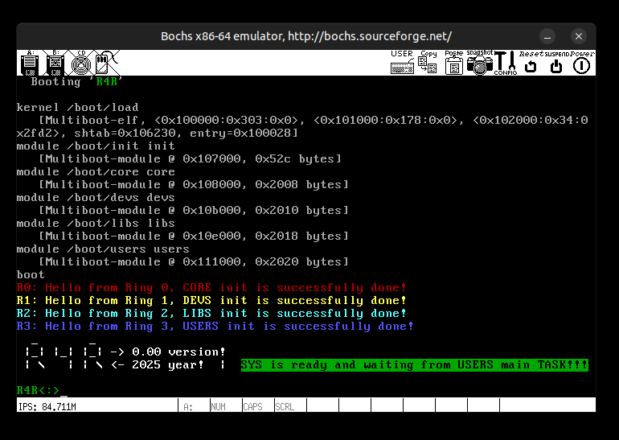

# 🧩 R4R – Version 0.00  
### The First Complete 4-Ring Boot and Transition

---

## ✨ Introduction

When you write something completely from scratch — from the first line of boot code to the first character printed on the screen — you’re not just programming.  
You are **learning to speak directly to the machine**.  

There are moments of frustration, long nights, and doubts that make you question everything —  
but the moment when hardware finally obeys your logic, when a simple “Hello” appears because you made it possible,  
that is the kind of reward that reminds you why we love this craft.

R4R was born from that feeling — from the curiosity to understand the processor not as an abstraction,  
but as a living mechanism that reveals its power only when you approach it with patience and respect.  

I wanted to see what Intel’s **four protection rings** truly meant — not in documentation,  
not in diagrams, but in *real execution*.  
Could they work together in a living system, all four rings — 0, 1, 2, and 3 —  
each with its own task, context, and stack, interacting through **call gates** and **hardware task switches**?

The answer is **yes** — and version 0.00 of R4R is that answer made real.  
Small, simple, imperfect — but **fully functional on real hardware**,  
marking the first build where all four rings cooperate as Intel once intended.

Version **0.00** represents the first fully functional proof-of-concept demonstrating the initialization and cooperation of **all four Intel x86 privilege rings** (Ring 0–3).  

This milestone shows that every ring can be independently initialized, given its own task(s), and then communicate through **hardware-managed transitions** using **call gates** and **task gates**.  

Version **0.00** of R4R marks more than just the first running build —  
it represents a personal milestone in understanding what it truly means  
to communicate with the machine at its lowest, most honest level.

---

## 🌍 Why Version 0.00 Was Born Here

This release was developed and tested primarily on a **real Intel 486 system**,  
not on a virtualized abstraction.  
While emulators like Bochs correctly honor the hardware model,  
QEMU (due to a long-standing bug) fails to reproduce task-switching through LDT/TSS —  
a critical mechanism for this concept.  

That limitation became a *motivation*, not an obstacle.  
By returning to **real hardware**, R4R version 0.00 reconnected with the original intent  
of x86’s privilege model: separation of trust enforced not by software checks,  
but by the processor’s own microcode.  

Publishing this version here, from that machine, is symbolic —  
the moment where curiosity met proof.  
The success on real hardware proves that this approach is not theoretical —  
it runs exactly as designed.

---

## 🧠 Concept Summary

R4R divides what would normally be a monolithic kernel into **four tiny mili-kernels**, each living in its own privilege level:

| Ring | mKernel |
|------|---------|
| **0** | Core |
| **1** | Devs |
| **2** | Libs |
| **3** | Users |

Each ring runs its own code and stack, defined through **individual TSS segments**, with legitimate transitions controlled entirely by hardware mechanisms.

This design fulfills Intel’s original idea of **hierarchical privilege isolation** — something most modern OSs simplify down to just Ring 0 and 3.

Each ring inherits the same paging context (flat mapping),  
but operates on isolated stack and descriptor space.

---

## ⚙️ Initialization Flow

The initialization follows this precise chain of hardware and software events:

1. **Boot & Load**  
   The system boots via **GRUB**, which loads all modules — the **init** module and the **four mili-kernels** — into memory addresses that are **hardcoded** in [`include/sys.h`](../include/sys.h).  
   Once loaded, the system enters **protected mode**.

2. **Init Phase**  
   During initialization, the **Core GDT**, **IDT** (with the first 32 exception handlers), and **Paging** are set up,  
   along with the essential **call gate descriptors** in the GDT required for system calls during early initialization.  
   Control then jumps into `main()`, which — through **IRET frames** — sequentially invokes each ring to perform  
   its own initialization and configuration via hardware **call gates**.

3. **Ring 0 (Core)**  
   Initializes memory management, loads all ring-specific descriptors, installs call gates,  
   and sets up the main task.  
   Prints diagnostic and initialization messages, then returns control to `main()` via `core_resume()`.  
   Afterward, `main()` triggers the first transition to **Ring 1 (Devs)** through an **IRET frame**.

4. **Ring 1 (Devs)**  
   Sets up its own **LDT**, **TSS entries**, and **call gates**.  
   Handles early hardware and device-layer initialization.  
   Prints initialization messages and returns control to `main()` via `core_resume()`,  
   which then triggers the transition to **Ring 2 (Libs)** using another **IRET frame**.

5. **Ring 2 (Libs)**  
   Sets up its own **LDT**, **TSS entries**, and **call gates**.  
   Represents shared kernel libraries and internal services.  
   Prints initialization messages and returns control to `main()`,  
   which continues the transition to **Ring 3 (Users)**.

6. **Ring 3 (Users)**  
   Sets up its own **LDT** and **TSS**.  
   Displays its own welcome message and logo.  
   Demonstrates user-space access through call gates — for example, the `syscall_printr()` system call.  
   Once completed, it safely returns to `main()` in **Ring 0**.

7. The final function in `main()` from **Ring 0 (Core)** performs the jump to  
   [`main_task()` in **Ring 3 (Users)**](../src/sys/init/main.c#L139-L150)  
   and remains there in a continuous loop — a fitting conclusion for the beginning.

> 🧩 *All text output from less-privileged rings is performed through system calls using call gate descriptors — without passing any arguments on the stack, but instead through available registers.*  
> This serves as the fundamental proof that **call gates** can operate correctly across all less-privileged rings toward Ring 0.  
> In later versions, we will also demonstrate **calls originating from Ring 3 to Ring 2 or 1**, as well as **from Ring 2 to Ring 1**,  
> showcasing how flexible and efficient this mechanism can be when used as Intel originally intended.

The structure ensures that no ring can directly modify or corrupt another —  
each can only communicate via hardware-controlled mechanisms.

This strict separation makes debugging and tracing state changes straightforward —  
each fault belongs unambiguously to its ring.

At this point, all four rings are **independently initialized and fully functional**.  
Transitions between them occur entirely through **hardware-defined mechanisms** — no software emulation or privilege hacks.

---

## 🧩 Paging and Memory Layout

Version **0.00** of R4R uses a **static paging model** combined with an explicit **segmentation layout**, designed for stability, visibility, and true hardware isolation across rings.  
The system operates within a **flat 8 MB physical space**, but segmentation and paging together form distinct protection domains for each privilege level.

Paging is initialized immediately after entering protected mode in **Ring 0**, once the GDT and IDT are set up.  
The **page directory** and **page tables** are preallocated in static memory (see [`include/sys.h`](../include/sys.h)), and loaded into **CR3** before paging is enabled in **CR0**.

### Memory Segmentation and Paging Overview

- Full identity mapping of the **0–8 MB** range.  
- `pg_tab0` (PDE[0]) maps **0–4 MB**, user-accessible (`U/S=1`), except the **lower 1 MB**, which remains supervisor-only (`U/S=0`).  
- `pg_tab1` (PDE[1]) maps **4–8 MB**, mostly user-accessible (`U/S=1`),  
  but the final **128 KB** region (`0x007E0000–0x007FFFFF`) is reserved for supervisor-only operations (`U/S=0`).  
- This configuration creates **isolated memory domains per ring**, using both **segmentation** and **paging** protection.

### Segmentation Model

Unlike modern kernels that rely on a **flat memory model**,  
R4R explicitly enforces logical segmentation through **real GDT segment base and limit definitions**.  
Each ring (0–3) operates within its own bounded memory area, protected by both:
- **Segmentation** — via base/limit descriptors in the GDT  
- **Paging** — via the `U/S` (User/Supervisor) bit in page table entries  

Critical regions, including the **first 1 MB** and the **top 128 KB** of the address space, are reserved for supervisor-only access, preventing accidental or malicious writes from user-level rings.

### Architectural Vision

R4R demonstrates an **alternative architectural philosophy** for x86 OS design:  
Instead of following the traditional Unix-like model that depends solely on paging,  
R4R restores **hardware-supported segmentation** as a first-class isolation mechanism.  

Each privilege level (Ring 0–3) can therefore have a **physically separated, GDT-constrained execution space** —  
a transparent and deterministic environment where protection is enforced by hardware, not software layers.

This design challenges the “flat-memory” convention of modern kernels and revives the elegance of **segmentation-based domain containment** —  
a concept that Intel originally envisioned but most systems never fully explored.

---

## 🔁 Task Switching and Call Gates

Task management in **R4R v0.00** is performed entirely through **hardware mechanisms**, not software scheduling or privilege simulation.  
This version demonstrates the two key methods Intel designed for transferring control across protection domains:  
**TSS-based task switching** and **Call Gates**.

### Hardware Task Switching

Each ring in R4R is represented by one or more **Task State Segment (TSS)** structures.  
Every TSS contains its own stack pointers, segment selectors, and I/O permissions map.  
When a `ljmp` or `lcall` instruction targets a TSS descriptor in the GDT, the processor performs a **hardware task switch** —  
saving the current state and loading the new one automatically, without software mediation.  

This ensures that:
- every ring executes on its own stack,  
- privilege transitions are atomic and hardware-verified, and  
- the previous task context can be restored simply by another far jump.

In **version 0.00**, task switching is used mainly for transitioning from initialization routines to each ring’s primary task (e.g., `tss_users_main`).  
These transitions are not yet part of a scheduler, but serve as proof of full **TSS-based ring independence**.

### Call Gates — The Core Communication Mechanism

**Call Gates** serve as the primary control-flow bridge between rings.  
Unlike trap gates or software interrupts, call gates are **parameterized and verified by hardware**.  
They define:
- the target segment selector,  
- the privilege level required for access, and  
- the number of parameters (if any) that the CPU should copy from the caller’s stack.

In **R4R**, call gates are used for **system calls and service requests** from less privileged rings (1–3) to Ring 0.  
For example, the `syscall_printr` interface allows any ring to print text to the screen through a call gate descriptor —  
**without passing arguments on the stack**, but instead through available general-purpose registers.  

This design demonstrates how call gates can safely and efficiently handle cross-ring communication  
without the need for software-managed stacks or manual privilege checks.

### Hardware-Backed Cooperation

Together, TSS and Call Gates form a **hardware-enforced messaging system** between rings:  
- TSS provides context separation and independent execution stacks.  
- Call Gates provide controlled entry points with privilege validation.  

All transitions in R4R v0.00 — whether between tasks or rings — occur **entirely within the CPU’s own microcode**,  
with no software emulation, traps, or privilege workarounds.  

This implementation serves as a living demonstration of Intel’s original vision for protected mode:  
a design where **hardware isolation and communication** coexist naturally,  
offering both performance and security through architectural discipline.

---

## 🧩 Technical Highlights

- Custom **GDT/TSS/LDT** design for each ring  
- Full **task-switching** using TSS descriptors  
- **Call gates** and **hardware ring transitions** instead of software traps  
- Separate **ring stacks** for Rings 0–3  
- Core uses **C + inline assembly** with `-std=c23` (GCC 14)  
- Paging enabled (currently static for 8 MB memory window)  
- Bootable via **Multiboot v1**  

---

## 🧮 Hardware-Level Philosophy

R4R is not merely an operating system in the software sense —  
it is a *hardware-cooperative system*.  
Instead of simulating privilege levels through layered abstractions,  
it embraces the processor’s own internal design as the final authority of control.

Modern operating systems often treat the CPU as a programmable host  
to be abstracted and virtualized.  
R4R takes the opposite approach: the CPU is the operating system’s core participant.  
Every protection check, every task switch, and every privilege transition  
is delegated to **hardware**, where it belongs.

This philosophy rests on a simple but profound belief:  
> “When hardware already provides the mechanisms for trust,  
> software should not try to imitate them — it should use them.”

### Core Principles

- **Segmentation is not obsolete** — when combined with paging, it forms a natural hierarchy of trust.  
- **Call Gates are not slow** — they are efficient, elegant, and designed for predictable control transfer.  
- **TSS is not outdated** — it remains the most precise context container for real hardware tasks.  
- **Paging is not enough** — without segmentation, memory protection loses spatial awareness.  

R4R therefore revives the *true protected mode* model of the Intel architecture:  
where segmentation, paging, privilege levels, and task switching operate together —  
not as relics, but as coherent parts of one secure, deterministic machine.

### Why It Matters

By running on real 486-class hardware, R4R reveals a truth that emulators sometimes hide:  
the elegance of the x86 protected-mode design still holds its ground.  
Each ring can exist independently, communicate safely, and respect the microcoded barriers set by the CPU itself.

This approach may seem unconventional today —  
but it is precisely this *unconventionality* that brings us closer  
to understanding how much modern systems have sacrificed  
for the sake of portability and abstraction.

R4R’s hardware-level design is a quiet statement:  
that the original beauty of the Intel architecture lies not in complexity,  
but in the discipline it demands —  
and in the reward it offers to those who dare to trust the silicon.

---

## 💾 Testing and Real Hardware Results

- ✅ **Bochs emulator:** perfect compliance, including TSS and call gates  
- ⚠️ **QEMU:** fails due to known i486 protected-mode bug  
  → `QEMU Bug 2024806 — "Protected mode LJMP via TSS/LDT fails with pc=nil"`  
- 🖥️ **Real hardware (Compaq Contura Aero 4/33C):**  
  Fully operational; ring transitions and paging verified during execution.

Running on real silicon confirmed that the theory holds:  
the original x86 protection model is fully functional when implemented faithfully.

---

## 📜 Tasks and Structure

Each ring has its own TSS-defined task(s):
- `tss_core_main`
- `tss_devs_irq`
- `tss_devs_sched`
- `tss_libs_irq`
- `tss_libs_sched`
- `tss_users_main`

At this stage, all tasks exist and can be invoked through **hardware task switching**,  
but only `tss_users_main` is active.  
Others serve as **placeholders** for the next phase — IRQ handling and cooperative task scheduling.

---

## 🚀 Next Steps (for Version 0.01)

Planned for version **0.01**:
- Introduce a minimal ring-aware scheduler  
- Implement IRQ redirection and interrupt controller per ring  
- Implement IRQ handler for keyboard input  
- Introduce a minimal message-passing model between mKernels  
- Extend Devs and Libs tasks to actively run loops or routines  
- Expand paging into a partial virtual memory system  
- Begin work on a small interactive user-space environment in Ring 3  

---

## 💬 Final Note

Version 0.00 concludes the **foundational stage** of R4R — where every protection ring is live, accessible, and initialized by legitimate hardware transitions.  

It is a proof — that four rings, properly initialized and respected,  
can coexist, communicate, and protect each other *in hardware*.

It is also a statement:  
that the elegance of x86 architecture was never in its complexity,  
but in the discipline it demanded from those who tried to master it.    

> *“From this point, everything above is just refinement —  
the hard part, the true 4-ring foundation, already works.”*

---

## 🖼️ Screenshots

**COMPAQ CONTURA AERO 4/33C (Real Hardware)**  

**BOCHS Emulator**  

---

## 🧾 License

**R4R** is distributed under the **MIT License**.  
Use freely for learning, research, or hobby OS development.

---
